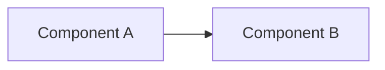

# Design Proposal Template

> Copy this template for new designs or significant changes. Complete all sections before submitting.
>
> File naming: `NNN-short-description.md` (NNN is an incrementing number)

---

## Metadata

- **Status**: Draft / Proposed / Accepted / Rejected / Superseded
- **Date**: YYYY-MM-DD
- **Author**: (name / GitHub ID)
- **Related ADR**: (if applicable, link to the ADR number in ADRs.md)

---

## 1. Problem

> Describe the concrete problem to solve in one or two paragraphs. Include background, current state, and pain points.

- What is the current state?
- What pain points or limitations exist?
- How are users/systems affected?

## 2. Goals

> Clear, measurable, verifiable goals.

- Goal 1 (quantifiable)
- Goal 2 (quantifiable)
- ...

## 3. Non-Goals

> Explicitly excluded scope, to avoid scope creep.

- This design does **not** include:
- Explicitly deferred to the future:

## 4. Proposed Design

### 4.1 Overall approach

> One or two paragraphs describing the core approach.

### 4.2 Detailed design

> Data structures, interfaces, flows, algorithms. Include diagrams (Mermaid / ASCII).

```go
// Example interface/data structure
type Foo struct { ... }
```



### 4.3 Relationship to existing code

> Affected files, interfaces to modify, compatibility.

## 5. Alternatives Considered

| Option | Pros | Cons | Why not chosen |
|--------|------|------|----------------|
| Option A | ... | ... | ... |
| Option B | ... | ... | ... |

## 6. Risks

| Risk | Impact | Mitigation |
|------|--------|------------|
| Risk 1 | ... | ... |

## 7. Test Plan

- Unit tests cover:
- Integration tests:
- Benchmarks:
- Compatibility verification:

## 8. Future Improvements

- Improvement 1 (target version)
- Improvement 2
